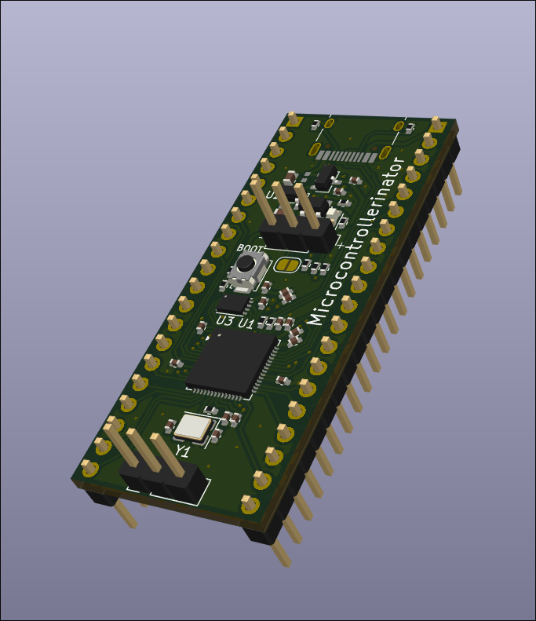
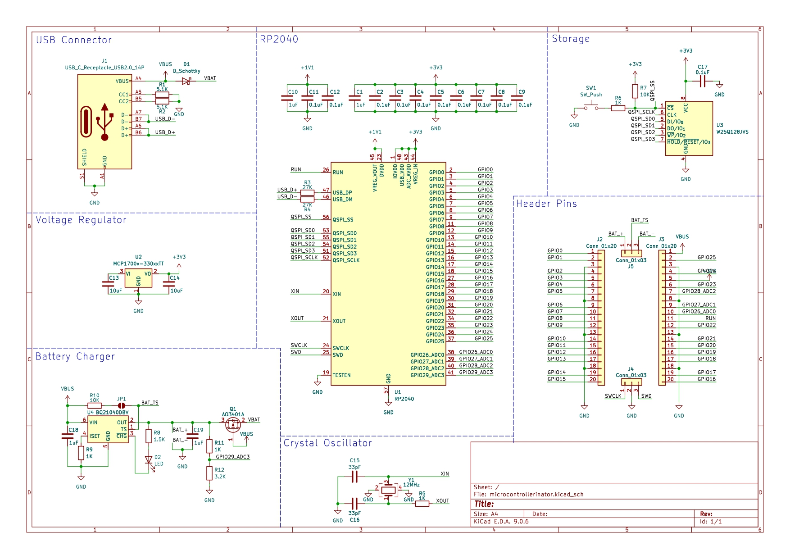
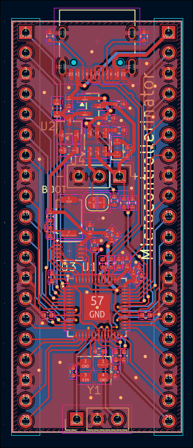

# Microcontrollerinator
Simple custom devboard based on the RP2040 with an integraded 1 cell li-ion charger.
This is my first complex pcb and to get my feet wet I mostly followed the example at https://blueprint.hackclub.com/starter-projects/devboard and added the BQ21040DBV battery charger. 

# How To Use
The board has the same pinout as the Raspberry Pi Pico exept ADC_VREF is GPIO23, 3V3_EN is GPIO24, and VSYS is GPIO25. GPIO29_ADC3 monitors the voltage of the battery multiplied by 1.3125 due to the resistor dividor. Pressing the switch will put the RP2040 into boot mode so it can be programed. The VBUS pin will output the current power supply voltage which will be 5v when plugged in but will be the direct battery voltage when unplugged. The battery pin headder has three pins, two for power and one for a thermistor to monitor temperature. The thermistor can be left hanging but there is a solder pad that enables a pull up resistor which is recomended in the charger datasheet.

